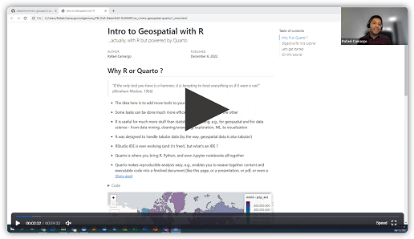

# Intro to Geospatial with R

...actually, with R but powered by Quarto

[{fig-align="left" width="30%"}](https://wwf.zoom.us/rec/share/bulydgm7q6ZctGup2Ije0xiLq8RK9DJWsBLAKGotLwDfElhX6bwgwAIQ0ctxljiY.GfEa6gowS50PkjRr?startTime=1670331794000)

## Why R or Quarto ?

> *"If the only tool you have is a hammer, it is tempting to treat everything as if it were a nail" (Abraham Maslow, 1966)*

-   The idea here is to add more tools to your toolbox

-   Some tasks can be done much more efficiently using one tool or the other

-   R is useful for much more stuff than statistical computing, e.g., for geospatial and for data science - from data mining, cleaning/wrangling, exploration, ML, to visualization

-   R was designed to handle tabular data (by the way, geospatial data is also tabular!)

-   RStudio IDE is ever evolving (and it's free!), but what's an IDE ?

-   Quarto is where you bring R, Python, and even Jupyter notebooks all together

-   Quarto makes reproducible analysis easy, e.g., enables you to weave together content and executable code into a finished document (as a html, or a presentation, or pdf, or even a [Shiny app](https://shiny.rstudio.com))

## Objective for this tutorial

-   Show you how to setup your R / Quarto environment so that it's ready to go when you need it

-   Show you some useful packages (i.e., libraries)

-   Show you some basic codes and some spatial stuff that R does nicely

-   Show you how to find the help you need

## Let's get started

-   Install [R and RStudio](https://posit.co/download/rstudio-desktop)

-   If you run on Win, it's good to install [RTools](https://cran.r-project.org/bin/windows/Rtools)

-   Install [Quarto](https://quarto.org)

-   Use Git to have version control (see [here](https://jennybc.github.io/2014-05-12-ubc/ubc-r/session03_git.html) for some quick instructions or [here](https://happygitwithr.com/index.html) for some more detail)

-   Create a new Rproj

-   Create a new Quarto document

-   Welcome to [tidyverse](https://www.tidyverse.org/) and the %\>% (i.e., pipe operator)

-   Get familiar with RStudio, e.g., Help \> Cheat Sheets as well as the Help \> Keyboard Shortcuts Help

## On this tutorial

-   Load different data formats into spatial objects

-   Skim quickly through your data

-   Manipulate data's attribute table

-   Spatial join two polygon shapefiles

-   Merge but faster

-   Rasterize but faster

-   Iterate your stuff

-   Manipulate NetCDF
